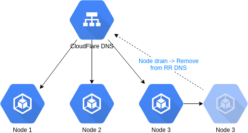

# k8s-dns-updater [](https://travis-ci.org/MySocialApp/k8s-dns-updater) [](https://quay.io/repository/mysocialapp/k8s-dns-updater)

Kubernetes DNS updater is a tool to automatically update DNS entries on a round robin (RR) configuration when a node goes into maintenance.



We've made this application at [MySocialApp](https://mysocialapp.io) in order to have automatic changes to:

* Add a node in the round robin DNS when a node is uncordon
* Remove a node from the round robin DNS when a node is drain

# Usage

Simply copy the example configuration file config.yaml.example to config.yaml and update the configuration with your needs:

```yaml
GlobalConfig:
  # Use node name (node) or dns name (dns) IP to update DNS
  UpdateDnsType: node
  # Maximum entries in the Round Robin DNS
  MaxDnsEntries: 10

# DNS info
DnsInfos:
  Name: "my-round-robin.domain.com"
  Type: A
  Ttl: 120
  Proxied: false

# Credentials
CloudFlareApiInfos:
  Zoneid: ""
  Zonename: ""
  Email: ""
  Key: ""
```

Then launch the binary in the same folder than the configuration file.

# Requirements

* Kubeconfig must be setup to be able to connect to a Kubernetes cluster
* Support only CloudFlare provider

# Todo

* Add Ingress support and detect ingress readiness before adding back in RR
* Add Ingress support and detect if an ingress readiness is failing to remove from RR
* Support a limit of the number of DNS entries in RR
